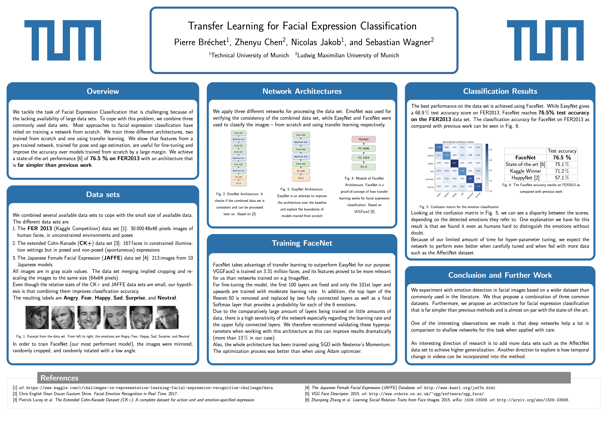

# transfer-learning-fer2013
Transfer learning with CNNs for Facial Expression Classification

## Project

This was a project for the class "Deep Learning for Computer Vision".

Technologies: Python, Tensorflow, Keras, PyTorch, Numpy

